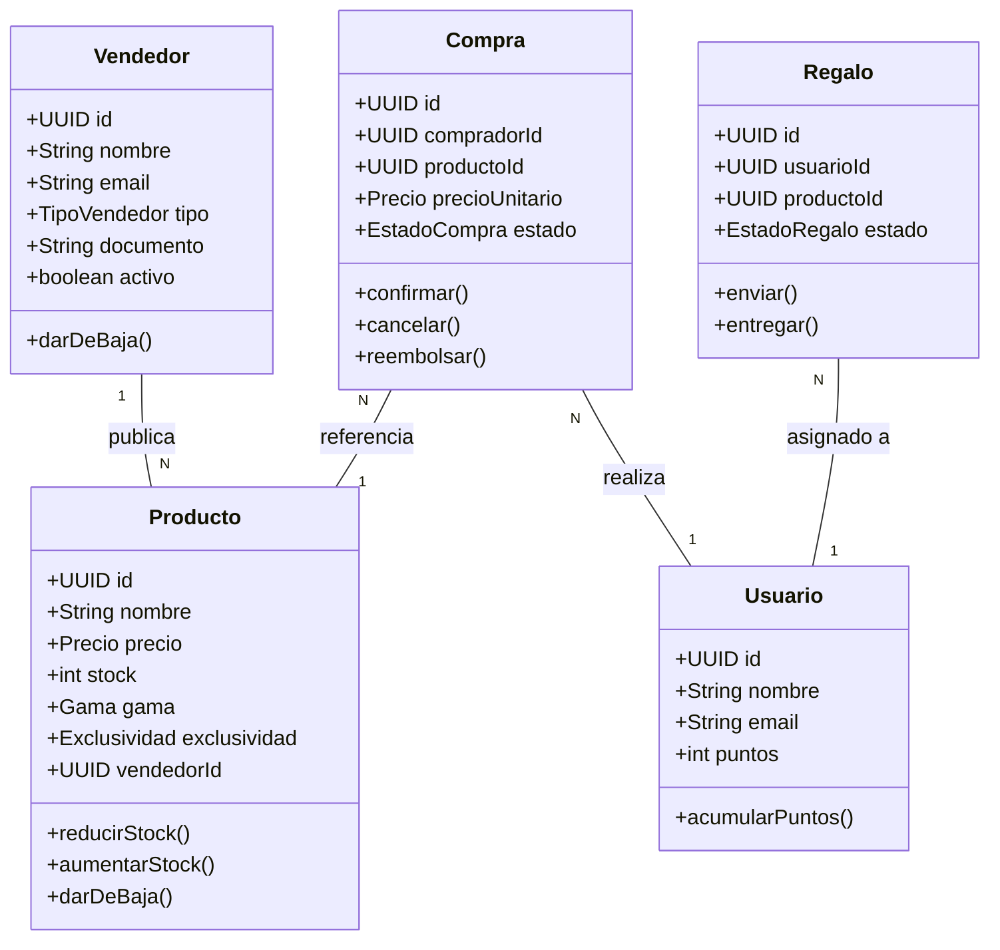

# 🎮 E-Commerce Marketplace Gamer


Sistema e-commerce descentralizado enfocado en productos y accesorios del mundo **Gaming**, desarrollado para la asignatura de Programación Avanzada / Ingeniería de Software en la **Universidad del Quindío**. El proyecto está guiado bajo los principios de **Domain-Driven Design (DDD)** y **Clean Architecture**.

---

## 📋 Tabla de Contenidos
1. [¿Quién compra y por qué?](#1-quién-compra-y-por-qué)
2. [¿Qué hace único a sus vendedores?](#2-qué-hace-único-a-sus-vendedores)
3. [Lenguaje Ubicuo (DDD)](#3-lenguaje-ubicuo-ddd)
4. [Reglas de Negocio e Invariantes del Dominio](#4-reglas-de-negocio-e-invariantes-del-dominio)
5. [Casos de Uso del Sistema (36 CUs)](#5-casos-de-uso-del-sistema-36-casos-de-uso)
6. [Diseño de Agregados y Dominio (DDD)](#6-diseño-de-agregados-y-dominio-ddd)
7. [Arquitectura del Software (Clean Architecture)](#7-arquitectura-del-software-clean-architecture)
8. [Guía de Instalación y Ejecución](#8-guía-de-instalación-y-ejecución)

---

## 1. ¿Quién compra y por qué?

El marketplace está diseñado conceptualmente para atender las necesidades específicas de la comunidad gamer:

* 🎮 **Gamers:** buscan productos de alto rendimiento que mejoren su experiencia competitiva (periféricos de alta precisión, componentes de hardware, sillas ergonómicas y accesorios dedicados).
* 🎥 **Streamers / Creadores de Contenido:** buscan productos funcionales y estéticamente atractivos (iluminación RGB, placas de captura, micrófonos condensadores, mobiliario) para personalizar sus setups de transmisión.
* 🕹️ **Jugadores Casuales:** buscan productos accesibles que garanticen confort, entretenimiento y una experiencia de juego amigable en su tiempo libre.

---

## 2. ¿Qué hace único a sus vendedores?

El sistema opera como un **marketplace multi-vendedor**, donde diversos comercios independientes pueden registrarse, gestionar su reputación y publicar su propia oferta comercial.

Categorías habilitadas en el catálogo:

* 🖱️ **Periféricos:** mouses, teclados mecánicos, audífonos Surround 7.1, mandos y mousepads XL.
* 🪑 **Mobiliario & Setup:** sillas ergonómicas, escritorios regulables, soportes de monitor e iluminación inteligente.
* 🎮 **Juegos Físicos & Coleccionables:** títulos en formato físico, figuras de acción y preventas exclusivas.
* 💻 **Licencias & Códigos Digitales:** claves para videojuegos, pases de batalla, gift cards y suscripciones.
* 🎁 **Combos Gamer:** paquetes promocionales de 2 o más productos ofrecidos a precio preferencial.

---

## 3. Lenguaje Ubicuo (DDD)

| Término | Definición en el Dominio |
| :--- | :--- |
| **Gama** | Clasificación técnica del producto según prestaciones y precio (`BAJA`, `MEDIA`, `ALTA`, `ENTUSIASTA`). |
| **Preventa** | Modalidad de compra anticipada habilitada antes de la fecha de liberación oficial del producto. |
| **Stock / Inventario** | Unidades físicas o licencias digitales disponibles en inventario (`stock >= 0`). |
| **Wishlist** | Lista de deseos personal para seguimiento de precios, promociones y disponibilidad de stock. |
| **Combo** | Agrupación promocional de 2 o más productos comercializados bajo una sola entidad con descuento. |
| **Comprador / Usuario** | Entidad compradora registrada que realiza transacciones, evalúa productos y acumula puntos. |
| **Vendedor** | Entidad comercial (Persona Natural o Empresa) registrada para publicar y vender productos. |
| **Puntos de Fidelización** | Unidades de beneficio otorgadas a compradores tras publicar reseñas de compras completadas. |
| **Regalo / Recompensa** | Beneficio otorgado por el sistema al usuario tras alcanzar metas de compra acumuladas. |
| **Exclusividad** | Restricción de compra que limita la adquisición a máximo una unidad por comprador. |
| **Eliminación Lógica** | Desactivación del estado visible de una entidad preservando la trazabilidad histórica de transacciones. |

---

## 4. Reglas de Negocio e Invariantes del Dominio

### Reglas Innegociables
1. **Stock No Negativo:** Un producto nunca puede tener stock inferior a cero (`stock >= 0`).
2. **Reseña Verificada:** Solo se permite calificar y reseñar productos con compras previas en estado `COMPLETADA`.
3. **Integridad de Productos con Compras:** No se puede eliminar físicamente un producto con historial de ventas; se debe usar **eliminación lógica**.
4. **Fechas de Preventa:** Ningún comprador puede acceder a productos en preventa antes de la fecha estipulada.
5. **Estructura de Combos:** Un combo debe estar compuesto obligatoriamente por **mínimo dos (2) productos** distintos.
6. **Acreditación de Puntos:** Los puntos de fidelización solo se asignan al registrar una reseña de una compra confirmada.
7. **Unicidad en Wishlist:** Un comprador no puede añadir duplicados del mismo producto a su Wishlist.
8. **Notificaciones Dirigidas:** Notificaciones por descuento o reposición de stock solo aplican a productos en la Wishlist del usuario.
9. **Límite Exclusivo:** Productos marcados como exclusivos solo pueden ser comprados una única vez por el mismo usuario.
10. **Metas de Recompensa:** Los regalos solo se asignan a usuarios que hayan cumplido las metas acumuladas de compra exigidas.

### Invariantes de los Agregados Técnicos
* **Agregado Producto:** Inmutable `vendedorId`; precio siempre positivo; `stock >= 0`; eliminación lógica ante ventas existentes.
* **Agregado Vendedor:** Identificación válida (Cédula/NIT) según `TipoVendedor` (Natural/Empresa); inactivación única por baja lógica.
* **Agregado Compra:** Máquina de estados estricta (`PENDIENTE` ➔ `COMPLETADA` / `CANCELADA` / `REEMBOLSADA`); precio congelado al momento de compra.
* **Agregado Regalo:** Transiciones de estado irreversibles (`ASIGNADO` ➔ `ENVIADO` ➔ `ENTREGADO`); requiere confirmación del comprador.

---

## 5. Casos de Uso del Sistema (36 Casos de Uso)

### 🛒 Módulo 1: Compras y Checkout
| Código | Caso de Uso | Actor | Descripción |
| :--- | :--- | :--- | :--- |
| `CU-01` | **Realizar Compra** | Comprador | Registra la orden de compra en estado `PENDIENTE` reservando inventario. |
| `CU-09` | **Confirmar Compra** | Comprador / Sistema | Valida la transacción y pasa la orden a `COMPLETADA`, descontando stock. |
| `CU-12` | **Cancelar / Expirar Compra Pendiente** | Comprador / Sistema | Cancela la compra por tiempo expirado o solicitud, liberando el stock. |
| `CU-18` | **Comprar Combo** | Comprador | Permite adquirir un combo verificando stock de todos sus integrantes. |
| `CU-30` | **Aplicar Cupón de Descuento** | Comprador | Aplica un código promocional al total del pago previo al checkout. |

### 📦 Módulo 2: Productos y Catálogo
| Código | Caso de Uso | Actor | Descripción |
| :--- | :--- | :--- | :--- |
| `CU-04` | **Publicar Producto** | Vendedor | Crea un nuevo producto especificando gama, precio, stock y atributos. |
| `CU-05` | **Modificar Producto** | Vendedor | Actualiza precio, descripción o disponibilidad de preventa. |
| `CU-06` | **Eliminar Producto** | Vendedor | Aplica eliminación lógica o física según existan transacciones previas. |
| `CU-15` | **Gestionar / Aumentar Stock** | Vendedor | Incrementa el número de unidades disponibles en inventario. |
| `CU-16` | **Editar Información General** | Vendedor | Actualiza detalles secundarios e imágenes del producto. |
| `CU-31` | **Filtrar y Buscar Productos** | Comprador | Búsqueda avanzada por gama, categoría, precio y preventas. |
| `CU-33` | **Activar / Pausar Publicación** | Vendedor | Alterna visibilidad del producto en el catálogo sin borrarlo. |
| `CU-34` | **Configurar Descuento Promocional** | Vendedor | Establece porcentajes de descuento temporales en un producto. |

### 🎁 Módulo 3: Combos Promocionales
| Código | Caso de Uso | Actor | Descripción |
| :--- | :--- | :--- | :--- |
| `CU-07` | **Crear Combo Gamer** | Vendedor | Agrupa 2 o más productos en una oferta empaquetada. |
| `CU-17` | **Modificar Productos de Combo** | Vendedor | Añade o remueve productos garantizando el mínimo de 2 unidades. |

### ⭐ Módulo 4: Reseñas, Puntos y Recompensas
| Código | Caso de Uso | Actor | Descripción |
| :--- | :--- | :--- | :--- |
| `CU-02` | **Subir Reseña y Asignar Puntos** | Comprador | Publica opinión y calificación asignando puntos de fidelidad. |
| `CU-08` | **Redimir Puntos por Beneficios** | Comprador | Canjea puntos por descuentos o productos de recompensa. |
| `CU-10` | **Asignar Regalo por Meta** | Admin / Sistema | Concede regalos del catálogo al cumplir metas acumuladas de compra. |
| `CU-35` | **Enviar / Confirmar Entrega de Regalo** | Admin / Sistema | Administra la logística y cambio de estado del regalo asignado. |

### ❤️ Módulo 5: Lista de Deseos (Wishlist)
| Código | Caso de Uso | Actor | Descripción |
| :--- | :--- | :--- | :--- |
| `CU-03` | **Añadir a Wishlist** | Comprador | Guarda productos de interés evitando registros duplicados. |
| `CU-13` | **Quitar de Wishlist** | Comprador | Elimina productos de la lista personal de deseos. |
| `CU-14` | **Notificar Descuento en Wishlist** | Sistema | Envía alertas cuando productos de la Wishlist bajan de precio. |
| `CU-32` | **Notificar Stock Disponible** | Sistema | Notifica cuando un producto agotado de la Wishlist reabastece inventario. |

### 👤 Módulo 6: Usuarios, Vendedores y Autenticación
| Código | Caso de Uso | Actor | Descripción |
| :--- | :--- | :--- | :--- |
| `CU-11` | **Registrar Usuario / Vendedor** | Público | Registro de cuentas de compradores o perfiles de vendedor. |
| `CU-19` | **Dar de Baja Vendedor** | Admin / Vendedor | Desactiva la cuenta del vendedor conservando la historia comercial. |
| `CU-20` | **Editar Perfil y Seguridad** | Usuario | Modificación de datos personales, dirección y contraseña. |
| `CU-21` | **Iniciar Sesión (JWT)** | Todos | Autenticación con token JWT seguro para el acceso a las APIs. |
| `CU-29` | **Valorar Vendedor** | Comprador | Calificación directa del servicio y atención brindada por el vendedor. |

### 📊 Módulo 7: Consultas, Métricas y Reportes
| Código | Caso de Uso | Actor | Descripción |
| :--- | :--- | :--- | :--- |
| `CU-22` | **Reporte de Ventas por Vendedor** | Vendedor | Balance de ingresos, unidades vendidas y comisiones. |
| `CU-23` | **Reporte de Productos Más Vendidos** | Admin / Vendedor | Escalafón de productos con mayor volumen de venta y calificación. |
| `CU-24` | **Consultar Historial de Compras** | Comprador | Muestra órdenes históricas, comprobantes y estados de entrega. |
| `CU-25` | **Consultar Historial de Puntos** | Comprador | Detalle de saldo de puntos ganados y redimidos. |
| `CU-26` | **Gestionar Metas de Recompensas** | Admin | Configura umbrales de compras para desbloquear regalos. |
| `CU-27` | **Alertas de Stock Bajo** | Vendedor | Reporte de inventario crítico o agotado para reabastecimiento. |
| `CU-28` | **Métricas de Reseñas** | Admin / Vendedor | Dashboard de satisfacción del cliente y calificaciones. |
| `CU-36` | **Reporte Global del Marketplace** | Admin | Consolidado ejecutivo del volumen total de operaciones. |

---

## 6. Diseño de Agregados y Dominio (DDD)

El modelo de dominio se compone de 5 Agregados Principales implementados en la capa `domain/entity`:



---

## 7. Arquitectura del Software (Clean Architecture)

El backend en Java 21 / Spring Boot implementa **Clean Architecture** estructurado en capas desacopladas:

```
backend/src/main/java/com/uniquindio/backend/
├── domain/                  # Capa de Dominio (Sin dependencias de frameworks)
│   ├── entity/              # Entidades Raíz de Agregados (Producto, Compra, Vendedor, Usuario, Regalo, Resena, Wishlist, Combo, Preventa)
│   ├── valueobject/         # Objetos de Valor (Gama, EstadoCompra, EstadoRegalo, TipoVendedor, Precio, Exclusividad)
│   ├── repository/          # Interfaces de Repositorio de Dominio
│   └── exception/           # Excepciones de Negocio
├── application/             # Capa de Aplicación (Casos de Uso)
│   ├── usecase/             # Lógica de Orquestación de Casos de Uso
│   └── dto/                 # Data Transfer Objects (DTOs)
└── infrastructure/          # Capa de Infraestructura (Spring Boot / Database)
    ├── controller/          # Controladores REST API
    └── persistence/         # Entidades JPA y Repositorios Spring Data JPA / MariaDB
```

---

## 8. Guía de Instalación y Ejecución

### Prerrequisitos
* **Java Development Kit (JDK):** Versión 21 o superior.
* **Base de Datos:** MariaDB / MySQL.
* **Gestor de Construcción:** Gradle (incluido en el proyecto vía Wrapper `./gradlew`).

### Pasos de Configuración

1. **Clonar el repositorio:**
   ```bash
   git clone https://github.com/ShanT237/EcommerceProductosGamer.git
   cd EcommerceProductosGamer/backend
   ```

2. **Compilar el proyecto:**
   ```bash
   ./gradlew build
   ```

3. **Ejecutar las pruebas unitarias e integración:**
   ```bash
   ./gradlew test
   ```

4. **Iniciar el servidor backend:**
   ```bash
   ./gradlew bootRun
   ```

El servidor Spring Boot iniciará por defecto en `http://localhost:8080`.
